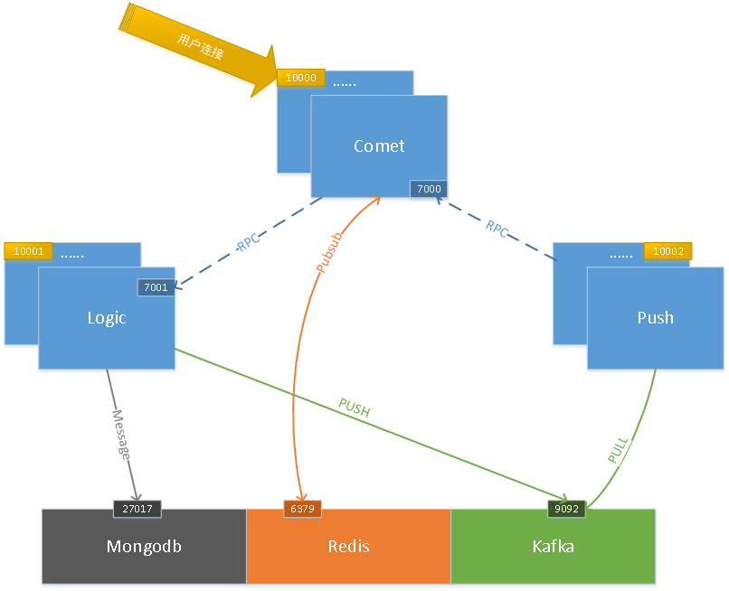

# gmimo 

Golang版本的IM服务

## 一、服务简介
- Comet: 接入服务
- Logic: 业务处理服务
- Push: 消息存储、转发服务



## 二、依赖库
- Http: [gin](https://github.com/gin-gonic/gin)
- RPC: [grpc](https://google.golang.org/grpc) [~~go-micro~~](https://github.com/micro/go-micro)
- 数据库: [go-redis](https://github.com/go-redis/redis) [mongo](https://go.mongodb.org/mongo-driver/mongo)


## 三、功能模块

### 1. Comet
- 用户的websocket连接及IM消息
    - [x] 创建连接加入房间(协议转换http->websocket)
    - [x] 关闭连接离开房间
    - [x] 发送IM消息(http api)
    - [x] 接收IM消息(通过websocket转发消息给用户)
- 用户连接的管理
    - [x] 每个comet本地维护自己的连接
    - [x] 通过Redis pub/sub, 更新每个comet本地的连接
- rpc client
    - [x] 加入房间(也提供http api)
    - [x] 离开房间(也提供http api)
    - [x] 调用logic服务管理用户-房间的关系
- rpc server
    - [x] 接收push服务的IM消息

```
comet
├─main.go
├─config    // 配置
│      config.go
│      config.ini
├─connection    // 管理websocket连接
│      ws.go
│      pubsub.go
├─docs      // swagger生成的文件
│      docs.go
│      swagger.json
│      swagger.yaml
├─model    // 数据模型
│      redis.go
├─router    // http路由
│      auth.go
│      home.go
│      message.go
│      room.go
│      router.go
│      user.go
│      ws.go
├─server    // 定义http服务
│      rpcServer.go
│      server.go
├─stub      // rpc的client、server
│      hello.go
│      init.go
│      message.go
│      room.go
└─util      // 工具
       jwt.go
```

### 2. Logic

- rpc server
    - [x] 加入房间、离开房间、房间用户列表、房间人数
    - [x] 接收comet的IM消息，推送给MQ

```
logic
├─main.go
├─config        // 配置
│      config.go
│      config.ini
├─controller    // 业务逻辑处理
│      kafkaMessage.go
│      room.go
├─model         // 数据模型
│      message.go
│      model_test.go
│      redis.go
│      room.go
│      user.go
├─router        // http路由
│      router.go
├─server        // 定义http、rpc服务
│      rpcServer.go
│      server.go
└─stub          // rpc的client、server
       hello.go
       hello_test.go
       message.go
       message_test.go
       room.go
       room_test.go
```

### 3. Push

- MQ消费IM消息
    - [x] 消费房间消息，存储到Redis，设置TTL
    - [x] 消费个人消息，存储到Mongo
    - [x] 消费全局消息，存储到Mongo
- rpc client
    - [x] 把IM消息发送给所有的comet服务
    
```
push
├─main.go
├─config        // 配置
│      config.go
│      config.ini
├─controller    // 业务处理
│      kafkaMessage.go
│      scheduler.go
│      storage.go
├─model         // 数据模型
│      message.go
│      mongo.go
│      redis.go
└─stub          // rpc的client、server
      init.go
      message.go
```

### 4. common
```
common
├─constant      // 全局变量
│      constant.go
├─e             // 定义错误码
│      code.go
│      error.go
│      msg.go
│      recovery.go
│      response.go
│      rpcResponse.go
├─log           // 日志模块
│      mylog.go
├─middleware    // http中间件
│      jwt.go
│      log.go
│      recovery.go
│      reqId.go
│      rpcLog.go
│      rpcRecovery.go
├─proto         // rpc proto文件
│  ├─hello
│  │      hello.pb.go
│  │      hello.proto
│  ├─message
│  │      cachePool.go
│  │      message.pb.go
│  │      message.proto
│  └─room
│  │      room.pb.go
│  │      room.proto
├─swagger       // swagger请求、响应的数据结构
│      request.go
│      response.go
└─util          // 工具
        set.go
        util.go
```

### 未完成
- rpc client连接池
- 服务注册，服务发现

## 四、使用

### 1. comet

生成swagger doc
> swag init

启动服务
> cd ./comet && go run main.go

访问swagger ui

http://localhost:10000/swagger/index.html

### 2. logic
启动服务
> cd ./logic && go run main.go

### 3. push
启动服务
> cd ./push && go run main.go

### 4. 其它

- 编译proto文件

~~protoc --go_out=. --micro_out=. common/proto/hello/hello.proto~~
> protoc --go_out=plugins=grpc:. room.proto

## 五、参考

- [Gin中文文档](https://www.kancloud.cn/shuangdeyu/gin_book/949411)

- [go-micro tutorials](https://github.com/micro-in-cn/tutorials)

- [mongo tutorial](https://www.mongodb.com/blog/post/mongodb-go-driver-tutorial)

- [go-redis doc](https://godoc.org/github.com/go-redis/redis)
- [Redis 数据类型介绍](http://www.redis.cn/topics/data-types-intro.html)
